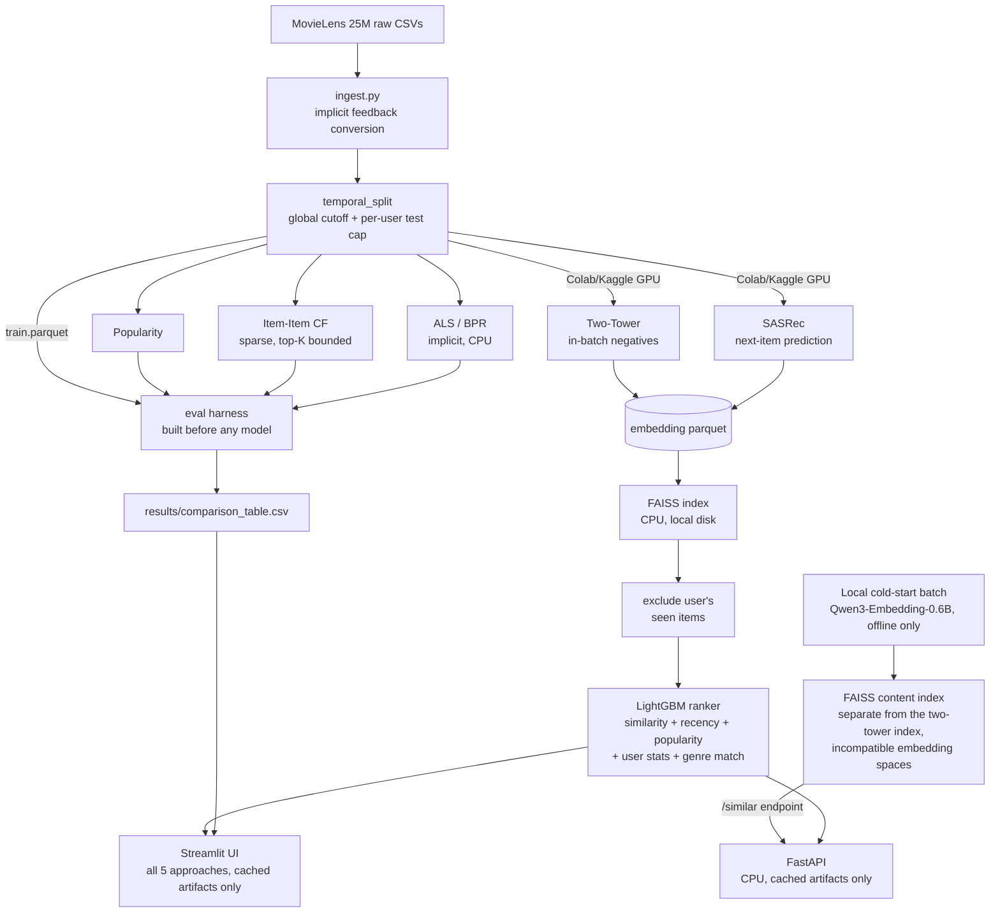

# ReelBench: Multi-Stage Recommender Benchmark

A production-style two-stage recommender system (candidate retrieval + ranking) on MovieLens 25M- benchmarking 5 approaches head-to-head under one evaluation harness. Trained on free-tier GPU (Colab/Kaggle), served entirely on CPU-only hardware.

The evaluation comparison table is the centerpiece deliverable, not the model count or the UI.

## Preview

<p align="center">
  
  <br>
  <sub><em>Main UI screen, curated personas (genre-profiled real users) or browse by any real MovieLens user ID.</em></sub>
</p>

Additional screenshots (`choose_viewer.png`, `recommendations.png`, `model_performance.png`) are in [`assets/`](assets/), one per dashboard view.

## What this is

Given the MovieLens 25M dataset, the pipeline:

1. Converts explicit ratings to implicit feedback (rating ≥ 4) and splits train/test on a single **global timestamp cutoff**, never a per-user-only split, a per-user-only leave-last-N-out split can still leak future signal across users even when each individual user's split looks correct in isolation.
2. Builds the evaluation harness (Recall@K, NDCG@K, MAP@K, coverage, intra-list diversity) **before** any model exists, and every model is scored through that same harness, same protocol, no exceptions.
3. Trains 5 approaches, popularity, item-item CF, ALS/BPR, a two-tower neural retriever, and SASRec, the first three on CPU locally, the neural two on free-tier Colab/Kaggle GPU.
4. Retrieves candidates via FAISS (CPU, local index) over the neural embeddings, excludes whatever the user has already interacted with, then re-ranks the survivors with LightGBM using embedding similarity, recency, popularity, user activity, and genre match as features.
5. Serves the production path (two-tower + ranker) via FastAPI, and separately compares all 5 approaches side-by-side in a Streamlit UI, both reading only cached local artifacts, no live model calls at request time.

## Architecture



## Approaches

| Approach | Library | Trained on | Notes |
|---|---|---|---|
| Popularity | - | CPU, local | Baseline floor; same ranked list for every user, filtered by what they've already seen. |
| Item-Item CF | scipy sparse | CPU, local | Cosine similarity computed in row-blocks with a bounded top-K per item; a naive dense similarity matrix at ml-25m's full ~62k-item catalog would need ~15GB at float32 and blow the 16GB RAM budget. |
| ALS / BPR | `implicit` | CPU, local | Matrix factorization; `scripts/run_phase1.py --mf-method {als,bpr}` (default `als`). Each method writes its own row (`als` / `bpr`) to comparison_table.csv, so both can be present at once. |
| Two-Tower | PyTorch | Colab/Kaggle GPU | User + item towers, in-batch negative sampling. Both towers are plain ID-embedding lookups plus a small MLP -- no content features (genres, text) go in, so it doesn't generalize to users/items outside the training vocabulary any better than ALS does; the benefit over ALS here is the learned negative-sampling objective, not feature-based generalization. Checkpointed every epoch, free-tier sessions can disconnect without warning, so training always resumes from the last saved epoch rather than assuming one uninterrupted run. |
| SASRec | PyTorch | Colab/Kaggle GPU | Causal self-attention over each user's chronological sequence, next-item prediction. Same checkpoint-resume discipline as the two-tower model. Fixed masking bug: the causal+padding mask used to produce NaN hidden states for any sequence shorter than `max_seq_len`, i.e. nearly every user. |

## Evaluation harness

Built and unit-tested (`tests/test_metrics.py`, `tests/test_split.py`) **before** any model, per the project's build order, every approach downstream is judged against this same harness, never a per-model variant.

- **Metrics**: Recall@10/20, NDCG@10/20, MAP@10/20, catalog coverage, intra-list diversity.
- **Protocol**: leave-last-N-out per user, but bounded by a single global timestamp cutoff, `assert_no_leakage()` checks both that no train row is at or after the cutoff and that no test user is absent from train, and is run as a hard stop before any model touches the split.
- **Output**: one committed table, `results/comparison_table.csv`, read directly by the Streamlit dashboard, never recomputed in the UI.
- **Ranker supervision stays inside train.** The LightGBM ranker needs its own positive/negative labels to train on, separate from candidate retrieval. Those labels come from `carve_ranker_supervision_split()` (`src/data/split.py`), a *second*, purely-internal temporal split applied to `train` alone: an earlier slice becomes the "seen" set for candidate generation, a later in-train slice becomes the labels. `test.parquet`, the harness's actual held-out set, is never read by ranker training, only by harness evaluation, so scoring the ranker later can't be inflated by having trained on its own answer key.
- **Fixed a subtler leak in the ranker's own features.** The split boundary above being correct wasn't enough on its own: `item_popularity`, `item_recency`, per-user activity stats, and genre profiles used to be computed from the *full* outer `train`, which contains the label slice (`ranker_split.test`) as a subset. That let a candidate's popularity/recency feature partially reflect the exact interaction it was being labeled on. `src.ranking.features.build_feature_context()` is now the one place these are computed, and every ranker-training caller (`build_serving_artifacts.py`, `build_ui_artifacts.py`, `generate_demo_artifacts.py`) passes it `ranker_split.train`, not `train` -- the same "nothing after this cutoff is visible" discipline `temporal_split` already applies at the outer boundary, just applied consistently at the inner one too. Serving and harness evaluation (`src/serving/app.py`, `scripts/evaluate_pipeline_models.py`) were never affected by this -- they correctly used the full `train` all along, since the real split cutoff *is* their prediction point.

## Robustness

A few specific failure modes this pipeline was built and tested to survive, not just handle in theory:

- **RAM-safe item-item CF**, sparse similarity computed in row-blocks, top-K bounded per item. Measured with `scripts/benchmark_item_item_cf_memory.py` on synthetic interaction data at ml-25m's real catalog scale (62,423 items, 162,541 users, ~13.7M interactions): peak RSS delta during `fit()` is ~1.4GB, well under the 16GB budget and far below the ~15GB a naive dense 62k×62k similarity matrix would need at float32.
- **Split leakage**, a single global timestamp cutoff, not a per-user-only split; unit-tested against a synthetic dataset specifically constructed so a per-user split would pass but a global-cutoff check would catch the leak.
- **NaN embeddings degrade gracefully, everywhere**, a malformed embedding makes FAISS return zero search results for that one user. The ranker-training step skips that user instead of crashing a multi-million-row build; the live serving/UI query path returns an empty recommendation list instead of raising. Both paths verified against real injected-NaN data, not just reasoned about.
- **Checkpoint resume**, both neural models save every epoch and resume from the last completed one on restart, including the embedding dimension and full ID-to-index mapping, so a resumed run can't silently reconstruct the model with mismatched shapes.

## Cold start

A one-time batch job embeds movie titles + genres locally with `Qwen3-Embedding-0.6B` via `sentence-transformers`, cached to parquet. **Never called live at serving time**, this is a cached artifact, produced once, offline. No API key, no rate limits, no daily quota, and no ongoing external dependency -- the model weights (~1.2GB) download once from Hugging Face on first run, then everything is local. Runs fine on CPU; `scripts/run_cold_start.py` prints a throughput estimate after the first batch so you know roughly how long the full ~62k-item ml-25m catalog will take before committing to the run, and it's resumable (skips movieIds already cached) if interrupted.

These content embeddings live in a completely different vector space than the two-tower/SASRec learned embeddings, nothing ties the two spaces together, so they can't be merged into the main retrieval FAISS index. Instead `build_serving_artifacts.py` builds a second, standalone FAISS index purely over the cold-start embeddings, and `src/serving/app.py` exposes it as `GET /similar/{movie_id}`, a content-based "more like this" lookup that works even for items with too little interaction history for a meaningful two-tower embedding.

## Serving

FastAPI (production path: two-tower + ranker) and the Streamlit UI (all 5 approaches, side-by-side) both read only local cached artifacts, FAISS index, ranker model, embedding parquet files. No live external API calls at request time, in either surface.

## Project Structure

```
recsys-movielens/
├── data/
│   ├── raw/                             # gitignored, MovieLens 25M CSVs
│   └── processed/                       # gitignored, parquet artifacts
│
├── assets/                              # main_ui.png, choose_viewer.png, recommendations.png, model_performance.png
│
├── notebooks/
│   └── recsys-movielens-notebook.ipynb  # Kaggle GPU training run log (two-tower, SASRec)
│
├── src/
│   ├── data/                            # ingestion, temporal split, persona curation
│   ├── eval/                            # metrics harness, MLflow/Dagshub tracking
│   │
│   ├── models/
│   │   ├── baseline.py                  # popularity, item-item CF
│   │   ├── mf.py                        # ALS/BPR
│   │   ├── two_tower.py                 # trained on Colab/Kaggle
│   │   └── sasrec.py                    # trained on Colab/Kaggle
│   │
│   ├── ranking/                         # LightGBM ranker + feature engineering
│   ├── retrieval/                       # FAISS index build + query
│   └── serving/                         # FastAPI app
│
├── ui/
│   ├── screens/                         # persona selector, recommendations, dashboard
│   ├── app.py                           # Streamlit entrypoint, run: streamlit run ui/app.py
│   ├── components.py                    # shared page header, KPI cards, empty states, genre icons
│   ├── data_access.py
│   └── styles.py                        # design tokens + custom CSS, "marquee" palette
│
├── .streamlit/config.toml               # pins Streamlit's native theme to match ui/styles.py
│
├── scripts/
│   ├── run_phase1.py                    # ingest → split → baselines → harness
│   ├── train_two_tower.py               # Colab/Kaggle entrypoint
│   ├── train_sasrec.py                  # Colab/Kaggle entrypoint
│   ├── build_serving_artifacts.py       # FAISS + ranker for FastAPI's production path
│   ├── build_ui_artifacts.py            # per-model FAISS + ranker for the UI's 5-way comparison
│   ├── evaluate_pipeline_models.py      # scores two-tower/SASRec through the harness
│   ├── curate_personas.py               # picks real users for the UI's curated personas
│   ├── run_cold_start.py                # local batch embedding job
│   ├── check_embeddings_for_nan.py      # diagnostic for embedding parquet files
│   ├── reexport_sasrec_embeddings.py    # re-export from an existing checkpoint without retraining
│   ├── generate_demo_artifacts.py       # synthetic data, for UI development only
│   └── benchmark_item_item_cf_memory.py # measures ItemItemCF.fit() peak RSS at ml-25m catalog scale
│
├── tests/
├── results/                             # comparison table, committed
│
├── .gitignore
├── requirements.txt
└── README.md
```

## Getting started

1. **Download MovieLens 25M**: https://files.grouplens.org/datasets/movielens/ml-25m.zip, unzip into `data/raw/ml-25m/`.

2. **Install** (requires Python 3.10+)
   ```bash
   python -m venv venv && source venv/bin/activate      # Windows: venv\Scripts\Activate.ps1
   pip install -r requirements.txt
   ```
   No GPU on your machine? `requirements.txt` pins `torch==2.4.1`, and a plain `pip install` pulls the full CUDA build by default, which is a large download and unnecessary for everything except *training* the two-tower/SASRec models from scratch (the "Phase 2/3, on Colab or Kaggle GPU" step below) — inference, evaluation, the UI, and the API all run fine on the CPU build. Install the CPU-only wheel instead, before or after the step above:
   ```bash
   pip install torch --index-url https://download.pytorch.org/whl/cpu
   ```
   If `pip install -r requirements.txt` pulls in the CUDA build anyway (it may not recognize the CPU wheel as satisfying the pin), just re-run the command above afterward to replace it.

3. **Experiment tracking (optional)**: runs log to MLflow locally with zero configuration. To log to a Dagshub-hosted MLflow server instead:
   ```bash
   export MLFLOW_TRACKING_URI="https://dagshub.com/<user>/<repo>.mlflow"
   export MLFLOW_TRACKING_USERNAME="<user>"
   export MLFLOW_TRACKING_PASSWORD="<dagshub-token>"
   ```

## Running it

```bash
# Phase 1, ingest, split, evaluation harness, 3 CPU baselines
python -m src.data.ingest
python scripts/run_phase1.py                 # add --mf-method bpr to run BPR instead of the default ALS
python scripts/curate_personas.py

# Phase 2/3, on Colab or Kaggle GPU, not locally
python scripts/train_two_tower.py --checkpoint-path <persistent-path> --output-dir data/processed --epochs 10
python scripts/train_sasrec.py --checkpoint-path <persistent-path> --output-dir data/processed --epochs 10
# copy the resulting *_embeddings.parquet files back into your local data/processed/

# Phase 4, retrieval + ranking artifacts, serving, UI
python scripts/build_serving_artifacts.py    # FastAPI's single production path
python scripts/build_ui_artifacts.py         # per-model artifacts for the UI's 5-way comparison
python scripts/evaluate_pipeline_models.py   # scores two-tower/SASRec through the harness, appends to results/comparison_table.csv
uvicorn src.serving.app:app --reload         # POST /recommend {"user_id": 1, "top_n": 10}, GET /similar/{movie_id}
streamlit run ui/app.py

# Optional
python scripts/run_cold_start.py
pytest tests/ -v
```

## Evaluation

`results/comparison_table.csv` is the project's centerpiece, not a checkbox, every approach that appears in it was scored through the identical harness in `src/eval/metrics.py`, on the identical held-out split, with a leakage assertion that runs before any model is trained.

## Known limitations

- **The committed `results/comparison_table.csv` is still synthetic demo data, not a real MovieLens 25M evaluation.** All 5 rows come from `scripts/generate_demo_artifacts.py` (400 synthetic users, 350 fictional movies, for UI development/screenshotting only), not `scripts/run_phase1.py` + `scripts/evaluate_pipeline_models.py` against a real ingested `ml-25m.zip`. Previously only 3 of these rows existed and the two neural rows were entirely missing; both gaps are now closed on the demo path (see the ranker-feature-leakage fix above, which also applies to this demo script), but this is still not a real-data result. To get one: delete `data/processed/models/*.pkl`, `results/comparison_table.csv`, and everything under `data/processed/` except the `.gitkeep` files, place a real `ml-25m.zip` under `data/raw/`, then run `python -m src.data.ingest`, `python scripts/run_phase1.py`, train both neural models (`notebooks/recsys-movielens-notebook.ipynb` or the two `train_*.py` scripts on Colab/Kaggle), and finish with `build_ui_artifacts.py` + `evaluate_pipeline_models.py`.
- **MovieLens 25M is a static, historical snapshot**, ratings stop at the dataset's collection date. The comparison table reflects relative model quality on that snapshot, not current catalog or taste trends.
