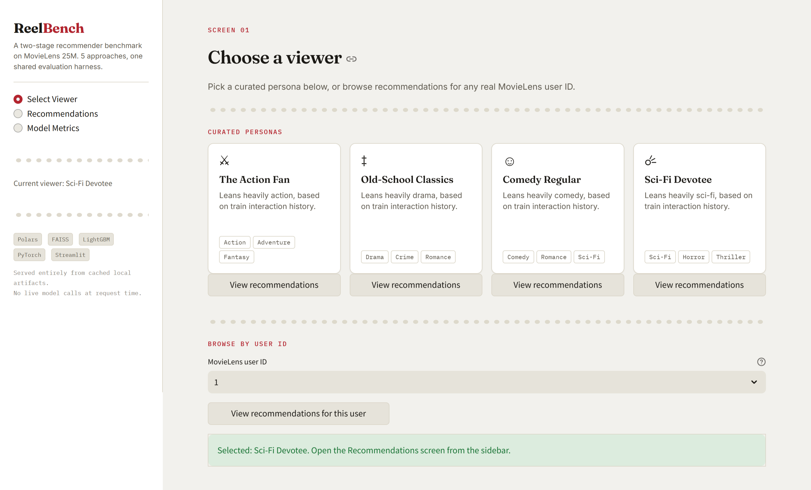
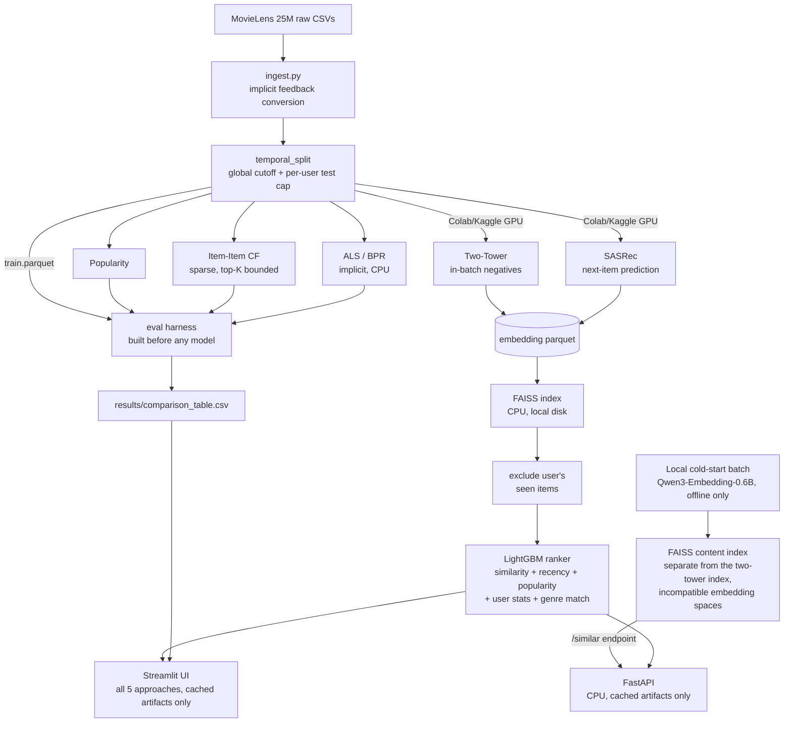

# ReelBench: Multi-Stage Recommender Benchmark

A production-style two-stage recommender system (candidate retrieval + ranking) on MovieLens 25M- benchmarking 5 approaches head-to-head under one evaluation harness. Trained on free-tier GPU (Colab/Kaggle), served entirely on CPU-only hardware.

The evaluation comparison table is the centerpiece deliverable, not the model count or the UI.

## Preview

<p align="center">
  
  <br>
  <sub>Select viewer: curated personas or browse by any real MovieLens user ID.</sub>
</p>

Additional screenshots in [`assets/`](assets/), one per dashboard view.

## What this is

Given the MovieLens 25M dataset, the pipeline:

1. Converts explicit ratings to implicit feedback (rating ≥ 4) and splits train/test on a single **global timestamp cutoff**, never a per-user-only split, a per-user-only leave-last-N-out split can still leak future signal across users even when each individual user's split looks correct in isolation.
2. Builds the evaluation harness (Recall@K, NDCG@K, MAP@K, coverage, intra-list diversity) **before** any model exists, and every model is scored through that same harness, same protocol, no exceptions.
3. Trains 5 approaches, popularity, item-item CF, ALS/BPR, a two-tower neural retriever, and SASRec, the first three on CPU locally, the neural two on free-tier Colab/Kaggle GPU.
4. Retrieves candidates via FAISS (CPU, local index) over the neural embeddings, excludes whatever the user has already interacted with, then re-ranks the survivors with LightGBM using embedding similarity, recency, popularity, user activity, and genre match as features.
5. Serves the production path (two-tower + ranker) via FastAPI, and separately compares all 5 approaches side-by-side in a Streamlit UI, both reading only cached local artifacts, no live model calls at request time.

## Architecture



## Approaches

| Approach | Library | Trained on | Notes |
|---|---|---|---|
| Popularity | - | CPU, local | Baseline floor; same ranked list for every user, filtered by what they've already seen. |
| Item-Item CF | scipy sparse | CPU, local | Cosine similarity computed in row-blocks with a bounded top-K per item; a naive dense similarity matrix at ml-25m's full ~62k-item catalog would need ~15GB at float32 and blow the 16GB RAM budget. |
| ALS / BPR | `implicit` | CPU, local | Matrix factorization; `scripts/run_phase1.py --mf-method {als,bpr}` (default `als`). Each method writes its own row (`als` / `bpr`) to comparison_table.csv, so both can be present at once. |
| Two-Tower | PyTorch | Colab/Kaggle GPU | User + item towers, in-batch negative sampling. Both towers are plain ID-embedding lookups plus a small MLP -- no content features (genres, text) go in, so it doesn't generalize to users/items outside the training vocabulary any better than ALS does; the benefit over ALS here is the learned negative-sampling objective, not feature-based generalization. Checkpointed every epoch, free-tier sessions can disconnect without warning, so training always resumes from the last saved epoch rather than assuming one uninterrupted run. |
| SASRec | PyTorch | Colab/Kaggle GPU | Causal self-attention over each user's chronological sequence, next-item prediction. Same checkpoint-resume discipline as the two-tower model. Fixed masking bug: the causal+padding mask used to produce NaN hidden states for any sequence shorter than `max_seq_len`, i.e. nearly every user. |

## Evaluation harness

Built and unit-tested (`tests/test_metrics.py`, `tests/test_split.py`) **before any model**, per the project build order. Every downstream approach is evaluated against this same harness—never a model-specific variant.

- **Metrics:** Recall@10/20, NDCG@10/20, MAP@10/20, catalog coverage, intra-list diversity.
- **Protocol:** Leave-last-N-out per user, bounded by one global timestamp cutoff. `assert_no_leakage()` hard-fails if any train row is at/after the cutoff or any test user is absent from train, before any model sees the split.
- **Output:** A single committed `results/comparison_table.csv`, read directly by Streamlit; the UI never recomputes results.
- **Ranker supervision:** LightGBM labels come from `carve_ranker_supervision_split()` (`src/data/split.py`), a second temporal split applied **only to outer train**. The earlier slice generates candidates; the later slice supplies labels. `test.parquet` is never used for ranker training—only final harness evaluation.
- **Ranker feature leakage fixed:** Ranker features (`item_popularity`, `item_recency`, user activity, genre profiles) previously used full outer `train`, exposing the label slice. `build_feature_context()` is now the single feature-construction path, and all ranker-training callers (`build_serving_artifacts.py`, `build_ui_artifacts.py`, `generate_demo_artifacts.py`) pass `ranker_split.train`. Serving and harness evaluation remain unchanged: they correctly use full `train` because the outer cutoff is their prediction point.

## Robustness

A few specific failure modes this pipeline was built and tested to survive, not just handle in theory:

- **RAM-safe item-item CF:** Sparse similarity is computed in row-blocks with top-K bounded per item. On synthetic ML-25M-scale data (62,423 items, 162,541 users, \~13.7M interactions), `fit()` peaks at \~1.4GB RSS—well below the 16GB budget and far below the \~15GB required by a dense 62k×62k float32 matrix.
- **Leakage-safe split:** Uses one global timestamp cutoff, not per-user-only splitting. Unit-tested on a dataset designed so a per-user split passes while the global-cutoff check catches the leak.
- **NaN-safe embeddings:** Malformed embeddings cause FAISS to return zero results for that user. Ranker training skips the affected user; serving/UI returns an empty recommendation list instead of failing. Both paths are verified with injected NaNs.
- **Checkpoint resume:** Both neural models checkpoint every epoch and resume from the last completed epoch, including embedding dimension and the full ID-to-index mapping, preventing silent shape or index mismatches.

## Cold start

- **Offline, cached embeddings:** Movie titles + genres are embedded once locally with `Qwen3-Embedding-0.6B` via `sentence-transformers` and cached to Parquet. Serving never calls the model. Weights (\~1.2GB) download once from Hugging Face; after that, there are no API keys, rate limits, quotas, or external runtime dependencies. CPU is supported, and `scripts/run_cold_start.py` reports throughput after the first batch and resumes by skipping already-cached movieIds.
- **Isolated retrieval space:** Content embeddings are independent of the two-tower/SASRec embedding spaces and cannot be merged into the main retrieval FAISS index. `build_serving_artifacts.py` therefore builds a separate FAISS index for cold-start embeddings, exposed by `src/serving/app.py` as `GET /similar/{movie_id}`—a content-based “more like this” path for items lacking enough interaction history for meaningful learned embeddings.

## Serving

FastAPI (production path: two-tower + ranker) and the Streamlit UI (all 5 approaches, side-by-side) both read only local cached artifacts, FAISS index, ranker model, embedding parquet files. No live external API calls at request time, in either surface.

## Project Structure

```
recsys-movielens/
├── data/
│   ├── raw/                             # gitignored, MovieLens 25M CSVs
│   └── processed/                       # also gitignored, parquet artifacts
│
├── assets/                              # images and screenshots
│
├── notebooks/
│   └── recsys-movielens-notebook.ipynb  # Kaggle GPU training run log (two-tower, SASRec)
│
├── src/
│   ├── data/                            # ingestion, temporal split, persona curation
│   ├── eval/                            # metrics harness, MLflow/Dagshub tracking
│   │
│   ├── models/
│   │   ├── baseline.py                  # popularity, item-item CF
│   │   ├── mf.py                        # ALS/BPR
│   │   ├── two_tower.py                 # trained on Colab/Kaggle
│   │   └── sasrec.py                    # trained on Colab/Kaggle
│   │
│   ├── ranking/                         # LightGBM ranker + feature engineering
│   ├── retrieval/                       # FAISS index build + query
│   └── serving/                         # FastAPI app
│
├── ui/
│   ├── screens/                         # persona selector, recommendations, dashboard
│   ├── app.py                           # Streamlit entrypoint, run: streamlit run ui/app.py
│   ├── components.py                    # shared page header, KPI cards, empty states, genre icons
│   ├── data_access.py
│   └── styles.py                        # design tokens + custom CSS, "marquee" palette
│
├── .streamlit/config.toml               # pins Streamlit's native theme to match ui/styles.py
│
├── scripts/
│   ├── run_phase1.py                    # ingest → split → baselines → harness
│   ├── train_two_tower.py               # Colab/Kaggle entrypoint
│   ├── train_sasrec.py                  # Colab/Kaggle entrypoint
│   ├── build_serving_artifacts.py       # FAISS + ranker for FastAPI's production path
│   ├── build_ui_artifacts.py            # per-model FAISS + ranker for the UI's 5-way comparison
│   ├── evaluate_pipeline_models.py      # scores two-tower/SASRec through the harness
│   ├── curate_personas.py               # picks real users for the UI's curated personas
│   ├── run_cold_start.py                # local batch embedding job
│   ├── check_embeddings_for_nan.py      # diagnostic for embedding parquet files
│   ├── reexport_sasrec_embeddings.py    # re-export from an existing checkpoint without retraining
│   ├── generate_demo_artifacts.py       # synthetic data, for UI development only
│   └── benchmark_item_item_cf_memory.py # measures ItemItemCF.fit() peak RSS at ml-25m catalog scale
│
├── tests/
├── results/                             # comparison table, committed
│
├── .gitignore
├── requirements.txt
└── README.md
```

## Getting started

1. **Download MovieLens 25M**: https://files.grouplens.org/datasets/movielens/ml-25m.zip, unzip into `data/raw/ml-25m/`.

2. **Install** (requires Python 3.10+)
   ```bash
   python -m venv venv && source venv/bin/activate      # Windows: venv\Scripts\Activate.ps1
   ```
   No GPU on your machine? Install the CPU-only `torch` wheel **before** `requirements.txt`, not after. `requirements.txt` itself doesn't pin `torch` (it's commented out -- training the two-tower/SASRec models happens on Colab/Kaggle GPU, not locally), but `sentence-transformers` (used by the local cold-start step) depends on `torch` transitively, and a plain `pip install` would otherwise resolve that to the default CUDA build, a large unnecessary download for a step that runs on CPU anyway:
   ```bash
   pip install torch --index-url https://download.pytorch.org/whl/cpu
   pip install -r requirements.txt
   ```
   If you do have a local GPU and want cold-start embedding to use it, skip the CPU-wheel line and just `pip install -r requirements.txt` -- `sentence-transformers` will pick up CUDA automatically if `torch` sees a device.

3. **Experiment tracking (optional)**: runs log to MLflow locally with zero configuration. To log to a Dagshub-hosted MLflow server instead:
   ```bash
   export MLFLOW_TRACKING_URI="https://dagshub.com/<user>/<repo>.mlflow"
   export MLFLOW_TRACKING_USERNAME="<user>"
   export MLFLOW_TRACKING_PASSWORD="<dagshub-token>"
   ```

## Running it

Phase 1, ingest, split, evaluation harness, 3 CPU baselines
```bash
python -m src.data.ingest
python scripts/run_phase1.py                 # add --mf-method bpr to run BPR instead of the default ALS
python scripts/curate_personas.py
```

Phase 2/3, on Colab or Kaggle GPU, not locally
```bash
python scripts/train_two_tower.py --checkpoint-path <persistent-path> --output-dir data/processed --epochs 10
python scripts/train_sasrec.py --checkpoint-path <persistent-path> --output-dir data/processed --epochs 10

# copy the resulting *_embeddings.parquet files back into your local data/processed/
```

Phase 4, retrieval + ranking artifacts, serving, UI
```bash
python scripts/build_serving_artifacts.py    # FastAPI's single production path
python scripts/build_ui_artifacts.py         # per-model artifacts for the UI's 5-way comparison
python scripts/evaluate_pipeline_models.py   # scores two-tower/SASRec through the harness, appends to results/comparison_table.csv
uvicorn src.serving.app:app --reload         # POST /recommend {"user_id": 1, "top_n": 10}, GET /similar/{movie_id}
streamlit run ui/app.py
```

Optional steps
```bash
python scripts/run_cold_start.py
pytest tests/ -v
```

## Evaluation

`results/comparison_table.csv` is the project's centerpiece, not a checkbox, every approach that appears in it was scored through the identical harness in `src/eval/metrics.py`, on the identical held-out split, with a leakage assertion that runs before any model is trained.

## Known limitations

- **`results/comparison_table.csv` reflects whichever pipeline last wrote to it.** On a fresh clone, before running anything, the committed table is `scripts/generate_demo_artifacts.py`'s synthetic output (400 synthetic users, 350 fictional movies, for UI development/screenshotting only) -- not a real MovieLens 25M evaluation.
- **Two-Tower's default hyperparameters (10 epochs, embedding_dim=64) can under-train relative to the other approaches.** On a full real ml-25m run, its recall@10 has come in below even the popularity baseline, paired with unusually high catalog coverage and a wide, unstable score range across a single user's top-K -- a pattern consistent with an embedding space that hasn't converged rather than a pipeline bug. If you see the same thing, more epochs is the first thing to try, not architecture changes -- the training loss curve typically hasn't flattened by epoch 10.
- **MovieLens 25M is a static, historical snapshot**, ratings stop at the dataset's collection date. The comparison table reflects relative model quality on that snapshot, not current catalog or taste trends.