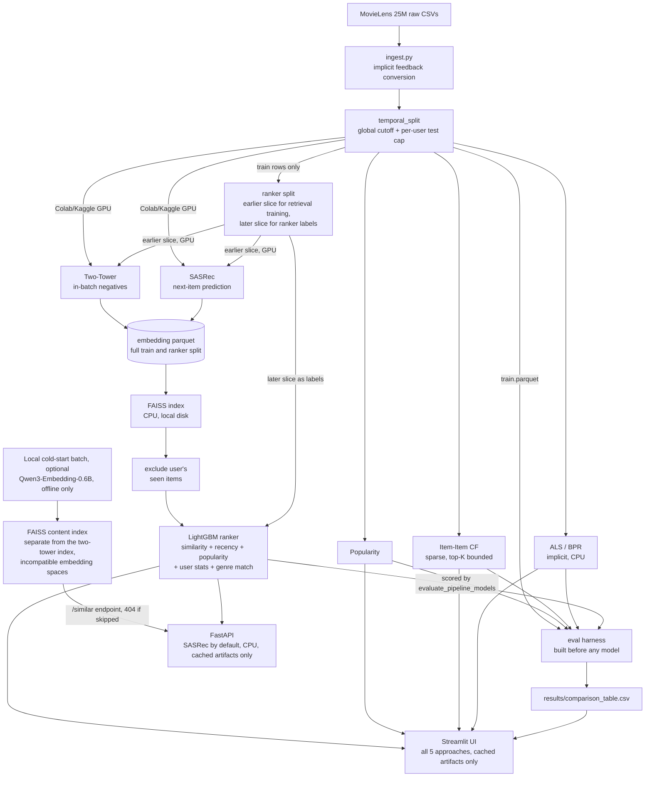

# ReelBench: Multi-Stage Recommender Benchmark

A production-style two-stage recommender system (candidate retrieval + ranking) on MovieLens 25M, benchmarking 5 approaches head-to-head under one evaluation harness. Trained on free-tier GPU (Colab/Kaggle), served entirely on CPU-only hardware.

The evaluation comparison table is the centerpiece deliverable, not the model count or the UI.

## Preview

<p align="center">
  
  <br>
  <sub>Select viewer: curated personas or browse by any real MovieLens user ID.</sub>
</p>

Additional screenshots in [`assets/`](assets/), one per dashboard view.

## What this is

Given the MovieLens 25M dataset, the pipeline:

1. Converts ratings to implicit feedback (rating ≥ 4) and splits on a single **global timestamp cutoff**, never a per-user-only split, which can leak future signal across users even when each user's split looks correct in isolation.
2. Builds the evaluation harness (Recall@K, NDCG@K, MAP@K, coverage, intra-list diversity) **before** any model. Every model is scored through it, no exceptions.
3. Trains 5 approaches: popularity, item-item CF and ALS/BPR on CPU locally, a two-tower retriever and SASRec on free-tier Colab/Kaggle GPU.
4. Retrieves candidates via FAISS over the neural embeddings, drops items the user has already seen, then re-ranks with LightGBM (LambdaRank) on embedding similarity, item recency, item popularity, user activity and genre match.
5. Serves SASRec + ranker by default (two-tower selectable) via FastAPI and compares all 5 approaches in a Streamlit UI. Both load only local cached artifacts and make no external calls at request time.

## Architecture


```mermaid
flowchart TD
    raw[MovieLens 25M raw CSVs] --> ingest[ingest.py\nimplicit feedback conversion]
    ingest --> split[temporal_split\nglobal cutoff + per-user test cap]
    split -->|train.parquet| harness[eval harness\nbuilt before any model]
    split -->|train rows only| rsplit[ranker split\nearlier slice for retrieval training,\nlater slice for ranker labels]

    split --> pop[Popularity]
    split --> cf[Item-Item CF\nsparse, top-K bounded]
    split --> als[ALS / BPR\nimplicit, CPU]
    split -->|Colab/Kaggle GPU| tt[Two-Tower\nin-batch negatives]
    split -->|Colab/Kaggle GPU| sasrec[SASRec\nnext-item prediction]
    rsplit -->|earlier slice, GPU| tt
    rsplit -->|earlier slice, GPU| sasrec

    pop --> harness
    cf --> harness
    als --> harness
    harness --> table[results/comparison_table.csv]

    tt --> embeddings[(embedding parquet\nfull train and ranker split)]
    sasrec --> embeddings
    embeddings --> faiss[FAISS index\nCPU, local disk]
    faiss --> seen[exclude user's\nseen items]
    seen --> ranker[LightGBM ranker\nsimilarity + recency + popularity\n+ user stats + genre match]
    rsplit -->|later slice as labels| ranker
    ranker -->|scored by evaluate_pipeline_models| harness

    coldstart[Local cold-start batch, optional\nQwen3-Embedding-0.6B, offline only] --> csfaiss[FAISS content index\nseparate from the two-tower index,\nincompatible embedding spaces]
    csfaiss -->|/similar endpoint, 404 if skipped| api

    ranker --> api[FastAPI\nSASRec by default, CPU, cached artifacts only]
    ranker --> ui[Streamlit UI\nall 5 approaches, cached artifacts only]
    pop --> ui
    cf --> ui
    als --> ui
    table --> ui
```

## Approaches

| Approach | Library | Trained on | Notes |
|---|---|---|---|
| Popularity | none | CPU, local | Floor baseline. Same ranked list for every user, minus items they have seen. |
| Item-Item CF | scipy sparse | CPU, local | Cosine similarity computed in row-blocks with a bounded top-K per item. A dense item-item matrix over the 31,195-item train catalog would be ~3.9GB at float32. `scripts/benchmark_item_item_cf_memory.py` measures peak RSS of `fit()` on synthetic data at that scale (Linux/macOS only). |
| ALS / BPR | `implicit` | CPU, local | `scripts/run_phase1.py --mf-method {als,bpr}` (default `als`). Each method writes its own row to the comparison table. Seeded with `random_state=42`. |
| Two-Tower | PyTorch | Colab/Kaggle GPU | ID-embedding user and item towers plus a small MLP, in-batch negatives with false-negative masking. No content features, so it does not generalize to unseen users or items. |
| SASRec | PyTorch | Colab/Kaggle GPU | Causal self-attention over each user's chronological sequence, full-softmax cross-entropy over overlapping windows of up to 51 items (50 input positions), so every transition in a user's history is used. |

Both neural models checkpoint every epoch and resume from the last completed one.

## Evaluation harness

Unit-tested before any model. Every approach goes through the same `evaluate_model` in `src/eval/harness.py`.

- **Metrics:** Recall, NDCG and MAP at 10 and 20, catalog coverage, intra-list genre diversity.
- **Protocol:** Train is everything before the global cutoff. Test is the first 10 interactions at or after it, for users with at least 5 train interactions. `assert_no_leakage()` hard-fails on train rows at or after the cutoff, test rows before it, or test users absent from train.
- **Ranker labels:** come from `carve_ranker_supervision_split()`, a second temporal split inside train. Candidates and ranker features use only the earlier slice (the `_rs` embeddings), and `test.parquet` is never touched during ranker training.
- **Output:** `results/comparison_table.csv`, read by Streamlit and never recomputed by the UI.
- **Tests:** `tests/` covers metrics, both splits, the leakage check (including a dataset where a per-user split passes and the global check catches the leak), ranking features, the ranker, FAISS, SASRec, the two-tower loss and the API.

## Cold start

An optional, offline content path for items with little interaction history.

- `scripts/run_cold_start.py` embeds `title | genres` for every movie with `Qwen3-Embedding-0.6B` (sentence-transformers, ~1.2GB download once, CPU is fine) and caches the result to `data/processed/cold_start_embeddings.parquet`. It resumes by skipping cached movieIds.
- `scripts/build_cold_start_index.py` builds a separate FAISS index from that cache. It cannot share the two-tower/SASRec index because the embedding spaces are unrelated.
- The API serves it at `GET /similar/{movie_id}`. Without the index it returns 404 naming the two scripts to run. Restart the API after building.

## Serving

Both surfaces read only cached local artifacts.

- **FastAPI** serves one pipeline (retrieval, seen-item filter, LightGBM re-rank). It defaults to `sasrec`; set `RECSYS_SERVING_MODEL=two_tower` to switch.
  - `GET /health`
  - `POST /recommend` with `{"user_id": 1, "top_n": 10}` and optional `retrieval_pool_size`. 404 for users without cached embeddings.
  - `GET /similar/{movie_id}?top_n=10`
- **Streamlit** compares all available approaches side by side for one viewer.
- A non-finite user embedding yields an empty recommendation list instead of an error, and the FAISS index refuses to build from non-finite item embeddings.

## Project Structure

```
reelbench/
├── data/
│   ├── raw/                               # gitignored, MovieLens 25M CSVs
│   └── processed/                         # also gitignored, parquet artifacts
│
├── assets/                                # images and screenshots
│
├── notebooks/
│   └── reelbench-notebook.ipynb           # Kaggle GPU training notebook (two-tower, SASRec), committed without outputs
│
├── src/
│   ├── data/                              # ingestion, temporal split, persona curation
│   ├── eval/                              # metrics harness, MLflow tracking
│   │
│   ├── models/
│   │   ├── baseline.py                    # popularity, item-item CF
│   │   ├── mf.py                          # ALS/BPR
│   │   ├── two_tower.py                   # trained on Colab/Kaggle
│   │   └── sasrec.py                      # trained on Colab/Kaggle
│   │
│   ├── ranking/                           # LightGBM ranker + feature engineering
│   ├── retrieval/                         # FAISS index build + query
│   └── serving/                           # FastAPI app
│
├── ui/
│   ├── screens/                           # persona selector, recommendations, dashboard
│   ├── app.py                             # Streamlit entrypoint, run: streamlit run ui/app.py
│   ├── components.py                      # shared page header, KPI cards, empty states, genre icons
│   ├── data_access.py
│   └── styles.py                          # design tokens + custom CSS, "marquee" palette
│
├── .streamlit/config.toml                 # pins Streamlit's native theme to match ui/styles.py
│
├── scripts/
│   ├── run_phase1.py                      # ingest → split → baselines → harness
│   ├── train_two_tower.py                 # Colab/Kaggle entrypoint
│   ├── train_sasrec.py                    # Colab/Kaggle entrypoint
│   ├── build_ui_artifacts.py              # per-model FAISS + ranker, used by the API, UI and evaluation
│   ├── evaluate_pipeline_models.py        # scores two-tower/SASRec through the harness
│   ├── curate_personas.py                 # picks real users for the UI's curated personas
│   ├── run_cold_start.py                  # local batch embedding job
│   ├── build_cold_start_index.py          # FAISS content index for /similar
│   ├── check_embeddings_for_nan.py        # diagnostic for embedding parquet files
│   ├── reexport_sasrec_embeddings.py      # re-export from an existing checkpoint without retraining
│   ├── generate_demo_artifacts.py         # synthetic data, for UI development only
│   └── benchmark_item_item_cf_memory.py   # measures ItemItemCF.fit() peak RSS at ml-25m catalog scale
│
├── tests/
├── results/                               # comparison table, committed
│
├── .gitignore
├── requirements.txt
└── README.md
```

## Getting started

1. **Data:** download https://files.grouplens.org/datasets/movielens/ml-25m.zip and unzip into `data/raw/ml-25m/`.
2. **Install** (Python 3.10+):
   ```bash
   python -m venv venv && source venv/bin/activate
   pip install torch --index-url https://download.pytorch.org/whl/cpu
   pip install -r requirements.txt
   ```
   On Windows activate with `venv\Scripts\Activate.ps1`. `torch` is not in `requirements.txt` because training happens on GPU elsewhere, but `sentence-transformers` needs it locally, so the CPU wheel goes first to avoid the large CUDA download. Skip that line if you have a local GPU.
3. **Configuration (optional):** `RECSYS_DATA_DIR` (default `data/processed`), `RECSYS_RESULTS_DIR` (default `results`), `RECSYS_SERVING_MODEL` (`sasrec` or `two_tower`).
4. **Experiment tracking (optional):** runs log to local MLflow with no setup. For a hosted server, set `MLFLOW_TRACKING_URI`, `MLFLOW_TRACKING_USERNAME` and `MLFLOW_TRACKING_PASSWORD`. The `dagshub` package is not needed and its `httpx` pin conflicts with current `huggingface-hub`.

## Running it

**Phase 1: ingest, split, harness, CPU baselines**
```bash
python -m src.data.ingest
python scripts/run_phase1.py
python scripts/curate_personas.py
```
Add `--mf-method bpr` to `run_phase1.py` for BPR instead of ALS.

**Phase 2/3: neural training on Colab/Kaggle GPU**

Upload `data/processed/train.parquet`, then train each model twice: once on full train (serving and evaluation embeddings) and once with `--ranker-split` (candidate generation for ranker training). Use a separate checkpoint path per run.
```bash
python scripts/train_two_tower.py --checkpoint-path <path>/two_tower.pt --output-dir data/processed --epochs 10
python scripts/train_two_tower.py --checkpoint-path <path>/two_tower_rs.pt --output-dir data/processed --epochs 10 --ranker-split
python scripts/train_sasrec.py --checkpoint-path <path>/sasrec.pt --output-dir data/processed --epochs 10
python scripts/train_sasrec.py --checkpoint-path <path>/sasrec_rs.pt --output-dir data/processed --epochs 10 --ranker-split
```
`notebooks/reelbench-notebook.ipynb` runs the same four trainings and checks the exports for NaN. Copy all eight resulting `*_embeddings.parquet` files into local `data/processed/`. A model is skipped in the next step if any of its four files is missing.

**Phase 4: artifacts, evaluation, serving, UI**
```bash
python scripts/build_ui_artifacts.py
python scripts/evaluate_pipeline_models.py
uvicorn src.serving.app:app
streamlit run ui/app.py
```
`evaluate_pipeline_models.py` upserts the two-tower and SASRec rows into `results/comparison_table.csv` and requires `build_ui_artifacts.py` first. Phase 1, GPU training and these two scripts are everything needed to reproduce the table.

**Optional**
```bash
python scripts/run_cold_start.py
python scripts/build_cold_start_index.py
pytest tests/ -v
```

**Diagnostics**
```bash
python scripts/check_embeddings_for_nan.py data/processed/sasrec_user_embeddings.parquet
python scripts/reexport_sasrec_embeddings.py --checkpoint-path <path>/sasrec.pt
```
Re-export works only if the checkpoint's parameters are all finite, otherwise retrain. Add `--ranker-split` for the `_rs` embeddings.

**UI development without real data:** `scripts/generate_demo_artifacts.py` builds a synthetic dataset (400 users, 350 movies) in `data/demo` and `results/demo`, leaving `data/processed` and `results` untouched. Its neural embeddings are noised ALS factors, so its table is meaningless. View it with:
```bash
RECSYS_DATA_DIR=data/demo RECSYS_RESULTS_DIR=results/demo streamlit run ui/app.py
```

## Evaluation

### Reported run

- **Data:** rating >= 4 as implicit feedback: 12,452,811 interactions, 162,342 users, 40,858 items.
- **Split:** global cutoff at timestamp 1514776152. Train: 11,202,874 rows, 148,745 users, 31,195 items. Test: 49,533 interactions, capped at 10 per user.
- **Neural training:** 10 epochs, embedding dim 64, lr 1e-3. Two-tower batch 512. SASRec batch 128, max sequence length 50.
- **Coverage** is the fraction of the 31,195 train items appearing in at least one user's top-20, with the same denominator for all rows. **Diversity** is mean intra-list genre diversity over top-20 lists.

### Results

| Model | Recall@10 | NDCG@10 | MAP@10 | Recall@20 | NDCG@20 | MAP@20 | Coverage | Diversity |
|---|---|---|---|---|---|---|---|---|
| Popularity | 0.0243 | 0.0242 | 0.0105 | 0.0393 | 0.0314 | 0.0122 | 0.0049 | 0.8143 |
| Item-Item CF | 0.0336 | 0.0321 | 0.0137 | 0.0587 | 0.0442 | 0.0167 | 0.0304 | 0.7955 |
| ALS | 0.0376 | 0.0367 | 0.0151 | 0.0649 | 0.0499 | 0.0181 | 0.0335 | 0.7784 |
| Two-Tower + ranker | 0.0329 | 0.0316 | 0.0131 | 0.0574 | 0.0432 | 0.0161 | 0.0540 | 0.7790 |
| SASRec + ranker | **0.0485** | **0.0432** | **0.0169** | **0.0832** | **0.0597** | **0.0207** | 0.0430 | 0.7660 |

Bold marks the best accuracy value per column. `results/comparison_table.csv` holds these values.

### Findings

- SASRec + ranker leads every accuracy metric. ALS is the strongest single-stage model.
- Two-Tower + ranker lands between popularity and ALS, level with Item-Item CF.
- Coverage is low for all approaches (under 6% of the catalog). Two-Tower has the highest, popularity the lowest.
- Popularity has the highest diversity. Diversity falls slightly as accuracy rises.

### Comparability caveats

- The two neural rows are end-to-end pipelines (FAISS retrieval, seen-item filter, LightGBM re-ranking) and the baselines are single-stage models. The comparison is pipeline against single-stage model, not embedding against embedding. The ranker also uses item popularity as a feature.
- One temporal split of 49,533 interactions, one run per model, no confidence intervals. Third-decimal differences, such as Two-Tower against Item-Item CF, are not a ranking.
- ALS is seeded but trains multithreaded, so its numbers can shift slightly between runs.

## Known limitations

- MovieLens 25M is a static snapshot. Results show relative model quality on that data, not current catalog or taste trends.
- The notebook is committed without outputs, so the training logs behind the reported run are not in the repository.