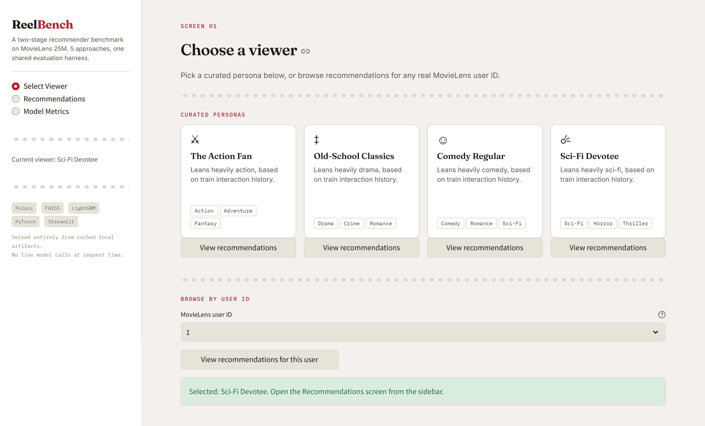
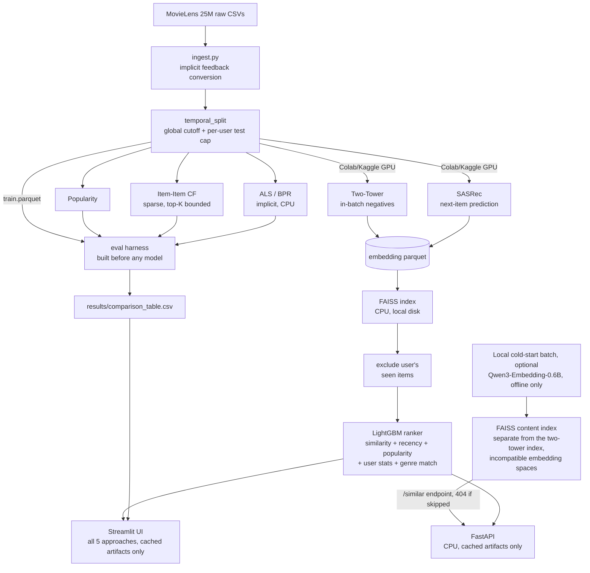

# ReelBench: Multi-Stage Recommender Benchmark

A production-style two-stage recommender system (candidate retrieval + ranking) on MovieLens 25M- benchmarking 5 approaches head-to-head under one evaluation harness. Trained on free-tier GPU (Colab/Kaggle), served entirely on CPU-only hardware.

The evaluation comparison table is the centerpiece deliverable, not the model count or the UI.

## Preview

<p align="center">
  
  <br>
  <sub>Select viewer: curated personas or browse by any real MovieLens user ID.</sub>
</p>

Additional screenshots in [`assets/`](assets/), one per dashboard view.

## What this is

Given the MovieLens 25M dataset, the pipeline:

1. Converts explicit ratings to implicit feedback (rating ≥ 4) and splits train/test on a single **global timestamp cutoff**, never a per-user-only split, a per-user-only leave-last-N-out split can still leak future signal across users even when each individual user's split looks correct in isolation.
2. Builds the evaluation harness (Recall@K, NDCG@K, MAP@K, coverage, intra-list diversity) **before** any model exists, and every model is scored through that same harness, same protocol, no exceptions.
3. Trains 5 approaches, popularity, item-item CF, ALS/BPR, a two-tower neural retriever, and SASRec, the first three on CPU locally, the neural two on free-tier Colab/Kaggle GPU.
4. Retrieves candidates via FAISS (CPU, local index) over the neural embeddings, excludes whatever the user has already interacted with, then re-ranks the survivors with LightGBM using embedding similarity, recency, popularity, user activity, and genre match as features.
5. Serves the production path (two-tower + ranker) via FastAPI, and separately compares all 5 approaches side-by-side in a Streamlit UI, both reading only cached local artifacts, no live model calls at request time.

## Architecture


```mermaid
flowchart TD
    raw[MovieLens 25M raw CSVs] --> ingest[ingest.py\nimplicit feedback conversion]
    ingest --> split[temporal_split\nglobal cutoff + per-user test cap]
    split -->|train.parquet| harness[eval harness\nbuilt before any model]

    split --> pop[Popularity]
    split --> cf[Item-Item CF\nsparse, top-K bounded]
    split --> als[ALS / BPR\nimplicit, CPU]
    split -->|Colab/Kaggle GPU| tt[Two-Tower\nin-batch negatives]
    split -->|Colab/Kaggle GPU| sasrec[SASRec\nnext-item prediction]

    pop --> harness
    cf --> harness
    als --> harness
    harness --> table[results/comparison_table.csv]

    tt --> embeddings[(embedding parquet)]
    sasrec --> embeddings
    embeddings --> faiss[FAISS index\nCPU, local disk]
    faiss --> seen[exclude user's\nseen items]
    seen --> ranker[LightGBM ranker\nsimilarity + recency + popularity\n+ user stats + genre match]

    coldstart[Local cold-start batch, optional\nQwen3-Embedding-0.6B, offline only] --> csfaiss[FAISS content index\nseparate from the two-tower index,\nincompatible embedding spaces]
    csfaiss -->|/similar endpoint, 404 if skipped| api

    ranker --> api[FastAPI\nCPU, cached artifacts only]
    ranker --> ui[Streamlit UI\nall 5 approaches, cached artifacts only]
    table --> ui
```

## Approaches

| Approach | Library | Trained on | Notes |
|---|---|---|---|
| Popularity | - | CPU, local | Baseline floor; same ranked list for every user, filtered by what they've already seen. |
| Item-Item CF | scipy sparse | CPU, local | Cosine similarity computed in row-blocks with a bounded top-K per item; a naive dense similarity matrix at ml-25m's full ~62k-item catalog would need ~15GB at float32 and blow the 16GB RAM budget. |
| ALS / BPR | `implicit` | CPU, local | Matrix factorization; `scripts/run_phase1.py --mf-method {als,bpr}` (default `als`). Each method writes its own row (`als` / `bpr`) to comparison_table.csv, so both can be present at once. |
| Two-Tower | PyTorch | Colab/Kaggle GPU | User + item towers, in-batch negative sampling. Both towers are plain ID-embedding lookups plus a small MLP -- no content features (genres, text) go in, so it doesn't generalize to users/items outside the training vocabulary any better than ALS does. |
| SASRec | PyTorch | Colab/Kaggle GPU | Causal self-attention over each user's chronological sequence, next-item prediction. Same checkpoint-resume discipline as the two-tower model. |

## Evaluation harness

Built and unit-tested (`tests/test_metrics.py`, `tests/test_split.py`, `tests/test_ranking_features.py`) **before any model**, per the project build order. Every downstream approach is evaluated against this same harness, never a model-specific variant.

- **Metrics:** Recall@10/20, NDCG@10/20, MAP@10/20, catalog coverage, intra-list diversity.
- **Protocol:** Leave-last-N-out per user, bounded by one global timestamp cutoff. `assert_no_leakage()` hard-fails if any train row is at/after the cutoff or any test user is absent from train, before any model sees the split.
- **Output:** A single committed `results/comparison_table.csv`, read directly by Streamlit; the UI never recomputes results.
- **Ranker supervision:** LightGBM labels come from `carve_ranker_supervision_split()` (`src/data/split.py`), a second temporal split applied **only to outer train**. The earlier slice generates candidates; the later slice supplies labels. `test.parquet` is never used for ranker training, only final harness evaluation.
- **Ranker feature leakage fixed:** Ranker features (`item_popularity`, `item_recency`, user activity, genre profiles) previously used full outer `train`, exposing the label slice. `build_feature_context()` is now the single feature-construction path, and all ranker-training callers (`build_serving_artifacts.py`, `build_ui_artifacts.py`, `generate_demo_artifacts.py`) pass `ranker_split.train`. Serving and harness evaluation remain unchanged: they correctly use full `train` because the outer cutoff is their prediction point.

## Robustness

A few specific failure modes this pipeline was built and tested to survive, not just handle in theory:

- **RAM-safe item-item CF:** Sparse similarity is computed in row-blocks with top-K bounded per item. On synthetic interaction data at MovieLens 25M scale (62,423 items, 162,541 users, \~13.7M interactions; see `scripts/benchmark_item_item_cf_memory.py`), `fit()` peaks at \~1.4GB RSS, well below the 16GB budget and far below the \~15GB required by a dense 62k×62k float32 matrix.
- **Leakage-safe split:** Uses one global timestamp cutoff, not per-user-only splitting. Unit-tested on a dataset designed so a per-user split passes while the global-cutoff check catches the leak.
- **NaN-safe embeddings:** Malformed embeddings cause FAISS to return zero results for that user. Ranker training skips the affected user; serving/UI returns an empty recommendation list instead of failing. Both paths are verified with injected NaNs. `scripts/check_embeddings_for_nan.py <path>` scans an embedding parquet directly, without a full pipeline run, to find affected rows.
- **Checkpoint resume:** Both neural models checkpoint every epoch and resume from the last completed epoch, including embedding dimension and the full ID-to-index mapping, preventing silent shape or index mismatches.
- **SASRec masking-bug recovery:** If an existing `sasrec.pt` checkpoint's weights are healthy but were exported before the mask fix, `scripts/reexport_sasrec_embeddings.py` re-exports from that checkpoint with the fixed `forward()`, no retraining needed. If training itself already produced NaN parameters, the checkpoint is corrupted and needs a full retrain instead; the script's docstring shows how to check which case you're in.

## Cold start

- **Offline, cached embeddings:** Movie titles + genres are embedded once locally with `Qwen3-Embedding-0.6B` via `sentence-transformers` and cached to Parquet. Serving never calls the model. Weights (\~1.2GB) download once from Hugging Face; after that, there are no API keys, rate limits, quotas, or external runtime dependencies. CPU is supported, and `scripts/run_cold_start.py` reports throughput after the first batch and resumes by skipping already-cached movieIds.
- **Isolated retrieval space:** Content embeddings are independent of the two-tower/SASRec embedding spaces and cannot be merged into the main retrieval FAISS index. `build_serving_artifacts.py` therefore builds a separate FAISS index for cold-start embeddings, exposed by `src/serving/app.py` as `GET /similar/{movie_id}`, a content-based “more like this” path for items lacking enough interaction history for meaningful learned embeddings.
- **Optional, and order matters:** `build_serving_artifacts.py` skips the cold-start index silently if `data/processed/cold_start_embeddings.parquet` doesn't exist yet; it's not a hard failure. But that means `run_cold_start.py` has to run **before** `build_serving_artifacts.py` for `/similar` to work. If you run it later, rerun `build_serving_artifacts.py` (and `build_ui_artifacts.py`, if you want the UI's cold-start path too) to pick up the new cache. Until then, `/similar/{movie_id}` returns a 404 telling you to do exactly that.

## Serving

FastAPI (production path: two-tower + ranker) and the Streamlit UI (all 5 approaches, side-by-side) both read only local cached artifacts, FAISS index, ranker model, embedding parquet files. No live external API calls at request time, in either surface.

## Project Structure

```
reelbench/
├── data/
│   ├── raw/                               # gitignored, MovieLens 25M CSVs
│   └── processed/                         # also gitignored, parquet artifacts
│
├── assets/                                # images and screenshots
│
├── notebooks/
│   └── reelbench-notebook.ipynb           # Kaggle GPU training run log (two-tower, SASRec)
│
├── src/
│   ├── data/                              # ingestion, temporal split, persona curation
│   ├── eval/                              # metrics harness, MLflow/Dagshub tracking
│   │
│   ├── models/
│   │   ├── baseline.py                    # popularity, item-item CF
│   │   ├── mf.py                          # ALS/BPR
│   │   ├── two_tower.py                   # trained on Colab/Kaggle
│   │   └── sasrec.py                      # trained on Colab/Kaggle
│   │
│   ├── ranking/                           # LightGBM ranker + feature engineering
│   ├── retrieval/                         # FAISS index build + query
│   └── serving/                           # FastAPI app
│
├── ui/
│   ├── screens/                           # persona selector, recommendations, dashboard
│   ├── app.py                             # Streamlit entrypoint, run: streamlit run ui/app.py
│   ├── components.py                      # shared page header, KPI cards, empty states, genre icons
│   ├── data_access.py
│   └── styles.py                          # design tokens + custom CSS, "marquee" palette
│
├── .streamlit/config.toml                 # pins Streamlit's native theme to match ui/styles.py
│
├── scripts/
│   ├── run_phase1.py                      # ingest → split → baselines → harness
│   ├── train_two_tower.py                 # Colab/Kaggle entrypoint
│   ├── train_sasrec.py                    # Colab/Kaggle entrypoint
│   ├── build_serving_artifacts.py         # FAISS + ranker for FastAPI's production path
│   ├── build_ui_artifacts.py              # per-model FAISS + ranker for the UI's 5-way comparison
│   ├── evaluate_pipeline_models.py        # scores two-tower/SASRec through the harness
│   ├── curate_personas.py                 # picks real users for the UI's curated personas
│   ├── run_cold_start.py                  # local batch embedding job
│   ├── check_embeddings_for_nan.py        # diagnostic for embedding parquet files
│   ├── reexport_sasrec_embeddings.py      # re-export from an existing checkpoint without retraining
│   ├── generate_demo_artifacts.py         # synthetic data, for UI development only
│   └── benchmark_item_item_cf_memory.py   # measures ItemItemCF.fit() peak RSS at ml-25m catalog scale
│
├── tests/
├── results/                               # comparison table, committed
│
├── .gitignore
├── requirements.txt
└── README.md
```

## Getting started

1. **Download MovieLens 25M**: https://files.grouplens.org/datasets/movielens/ml-25m.zip, unzip into `data/raw/ml-25m/`.

2. **Install** (requires Python 3.10+)
   ```bash
   python -m venv venv && source venv/bin/activate
   ```
   On Windows, activate with `venv\Scripts\Activate.ps1` instead.
   No GPU on your machine? Install the CPU-only `torch` wheel **before** `requirements.txt`, not after. `requirements.txt` itself doesn't pin `torch` (it's commented out -- training the two-tower/SASRec models happens on Colab/Kaggle GPU, not locally), but `sentence-transformers` (used by the local cold-start step) depends on `torch` transitively, and a plain `pip install` would otherwise resolve that to the default CUDA build, a large unnecessary download for a step that runs on CPU anyway:
   ```bash
   pip install torch --index-url https://download.pytorch.org/whl/cpu
   pip install -r requirements.txt
   ```
   If you do have a local GPU and want cold-start embedding to use it, skip the CPU-wheel line and just `pip install -r requirements.txt` -- `sentence-transformers` will pick up CUDA automatically if `torch` sees a device.

3. **Experiment tracking (optional)**: runs log to MLflow locally with zero configuration. To log to a Dagshub-hosted MLflow server instead:
   ```bash
   export MLFLOW_TRACKING_URI="https://dagshub.com/<user>/<repo>.mlflow"
   export MLFLOW_TRACKING_USERNAME="<user>"
   export MLFLOW_TRACKING_PASSWORD="<dagshub-token>"
   ```

   The `dagshub` Python package is not required and is not in `requirements.txt`: the environment variables above are sufficient, and its pinned `httpx` conflicts with current `huggingface-hub` releases, which makes `pip install -r requirements.txt` fail to resolve.

## Running it

Run the phases in order with the virtual environment active and the raw data in place.

Phase 1, ingest, split, evaluation harness, 3 CPU baselines
```bash
python -m src.data.ingest
python scripts/run_phase1.py
python scripts/curate_personas.py
```
Pass `--mf-method bpr` to `run_phase1.py` to run BPR instead of the default ALS.

Phase 2/3, on Colab or Kaggle GPU, not locally
```bash
python scripts/train_two_tower.py --checkpoint-path <persistent-path> --output-dir data/processed --epochs 10
python scripts/train_sasrec.py --checkpoint-path <persistent-path> --output-dir data/processed --epochs 10
```
Upload the `data/processed/train.parquet` written by Phase 1 to the GPU session so both models train on the exact split the harness scores against, then copy the four resulting `*_embeddings.parquet` files back into your local `data/processed/`. `notebooks/reelbench-notebook.ipynb` is the log of the reported run.

Phase 4, retrieval + ranking artifacts, serving, UI
```bash
python scripts/build_serving_artifacts.py
python scripts/build_ui_artifacts.py
python scripts/evaluate_pipeline_models.py
uvicorn src.serving.app:app --reload
streamlit run ui/app.py
```
- `build_serving_artifacts.py` builds the single production path for FastAPI.
- `build_ui_artifacts.py` builds the per-model FAISS index and LightGBM ranker for the UI's 5-way comparison, and must run before `evaluate_pipeline_models.py`.
- `evaluate_pipeline_models.py` scores two-tower and SASRec through the harness and upserts their rows into `results/comparison_table.csv`.
- The API exposes `GET /health`, `POST /recommend` with body `{"user_id": 1, "top_n": 10}`, and `GET /similar/{movie_id}`.

To reproduce only the comparison table, Phase 1, the GPU training, `build_ui_artifacts.py` and `evaluate_pipeline_models.py` are sufficient; `build_serving_artifacts.py` is not needed.

Optional steps
```bash
python scripts/run_cold_start.py
pytest tests/ -v
```
Run `run_cold_start.py` before `build_serving_artifacts.py`, or rerun that script afterward, to enable `/similar`.

Diagnostics, as needed
```bash
python scripts/check_embeddings_for_nan.py data/processed/sasrec_user_embeddings.parquet
python scripts/reexport_sasrec_embeddings.py --checkpoint-path data/processed/checkpoints/sasrec.pt
```

Do not run `scripts/generate_demo_artifacts.py` against a real `data/processed/`. It overwrites the interactions, train split, embeddings, FAISS indices, rankers, personas and `results/comparison_table.csv` with synthetic data (400 users, 350 movies). It exists only for UI development and screenshots.

## Evaluation

`results/comparison_table.csv` is the project's centerpiece, not a checkbox. Every approach in it was scored through the identical harness in `src/eval/metrics.py`, on the identical held-out split, with a leakage assertion that runs before any model is trained.

### Reported run

- **Data:** MovieLens 25M with rating >= 4 as implicit feedback: 12,452,811 interactions, 162,342 users, 40,858 items.
- **Split:** global cutoff at timestamp 1514776152. Train has 11,202,874 rows, 148,745 users and 31,195 items. Test has 49,533 interactions, capped at 10 per user.
- **Neural training:** Kaggle Tesla T4, 10 epochs, embedding dim 64. Two-tower: batch 512, lr 1e-3, average loss 6.1409 at epoch 0 to 5.3378 at epoch 9. SASRec: batch 128, lr 1e-3, max sequence length 50, average loss 9.8021 to 6.6540. Losses are not comparable across the two models.
- **Coverage** is the fraction of the 31,195 train items that appear in at least one user's top-20, and is computed with the same denominator for all five rows. **Diversity** is mean intra-list genre diversity over the top-20 lists.

### Results
 
| Model | Recall@10 | NDCG@10 | MAP@10 | Recall@20 | NDCG@20 | MAP@20 | Coverage | Diversity |
|---|---|---|---|---|---|---|---|---|
| Popularity | 0.0243 | 0.0242 | 0.0105 | 0.0393 | 0.0314 | 0.0122 | 0.0049 | 0.8143 |
| Item-Item CF | 0.0336 | 0.0321 | 0.0137 | 0.0587 | 0.0442 | 0.0167 | 0.0304 | 0.7955 |
| ALS | 0.0376 | 0.0367 | 0.0151 | 0.0649 | 0.0499 | 0.0181 | 0.0335 | 0.7784 |
| Two-Tower + ranker | 0.0329 | 0.0316 | 0.0131 | 0.0574 | 0.0432 | 0.0161 | 0.0540 | 0.7790 |
| SASRec + ranker | **0.0485** | **0.0432** | **0.0169** | **0.0832** | **0.0597** | **0.0207** | 0.0430 | 0.7660 |
 
Bold marks the best accuracy value per column. `comparison_table.csv` holds these same values; rerunning `evaluate_pipeline_models.py` replaces the rows with next values.
 
### Reading the results
 
- Baselines are unaffected by the fixes, which touch only the neural pipelines.
- SASRec was expected to stay strongest and widen its lead over ALS: it does, it trains on full histories, retrieves with the inner product it trains with, and feeds a ranker trained on honest labels.
- Two-tower was expected to move from below popularity to roughly item-item CF level, still behind ALS, it does exactly that, with coverage falling from an implausibly high value once pools are full and the ranker stops training on leaked similarity.
- Top-20 lists should stay concentrated on popular items for every approach.

### Comparability caveats

- The two neural rows are end-to-end pipelines (FAISS retrieval, seen-item filter, LightGBM re-ranking), while the three baselines are single-stage models. The comparison is pipeline against single-stage model, not embedding against embedding. The ranker also uses item popularity as a feature.
- The test set is one temporal split of 49,533 interactions, one run per model, with no confidence intervals. Differences in the third decimal, such as Two-Tower against Item-Item CF on NDCG@10, should not be read as a ranking.
- ALS is not seeded and trains multithreaded, so its numbers can shift slightly between runs.

## Known limitations

- **`results/comparison_table.csv` reflects whichever pipeline last wrote to it.** The committed table is the real MovieLens 25M run above. `scripts/generate_demo_artifacts.py` writes synthetic output to the same paths; a quick check is that real coverage values are multiples of 1/31,195, while demo values are multiples of 1/350.
- **Two-Tower gets under-trained at the default hyperparameters (10 epochs, embedding_dim=64).** Its recall@10 (0.0174) was below even the popularity baseline (0.0243), with unusually high catalog coverage. More epochs is the first thing to try, not architecture changes.
- **MovieLens 25M is a static, historical snapshot**, ratings stop at the dataset's collection date. The comparison table reflects relative model quality on that snapshot, not current catalog or taste trends.